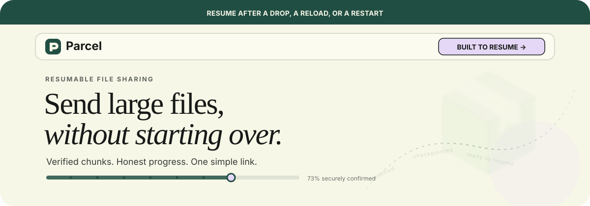
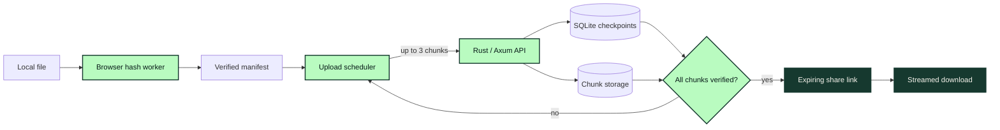

<div align="center">
  

  <br />
  <br />

  <a href="#status"></a>
  <a href="#planned-stack"></a>
  <a href="#planned-stack"></a>
  <a href="#principles"></a>

  <h3>Send a large file through a link.<br />Pick up exactly where you left off.</h3>

  <p>
    A self-hosted file-transfer service designed for unreliable connections,<br />
    browser restarts, and files too large to start over.
  </p>
</div>

---

## Status

> [!IMPORTANT]
> **Parcel is currently a product specification, not a working application.** This repository is the home for the planned MVP. Implementation has intentionally not started yet.

## The idea

Most file-sharing tools treat a broken connection as a failed upload. Parcel treats it as a pause.

A sender selects one file, Parcel splits it into verified chunks, and the server checkpoints every confirmed piece. If the browser closes, the network disappears, or the server restarts, the sender can reselect the same file and continue with only the missing chunks. When the upload is complete, Parcel creates an expiring link that anyone can use—no recipient account or app required.

```
select → fingerprint → upload chunks → verify → share
                         ↘ pause
                           resume only what is missing ↗
```

## Planned experience

### For senders

- Drag in a file and choose a 1, 24, or 72-hour expiration.
- See honest preparation, upload, verification, and ready states.
- Pause manually or recover after a dropped connection.
- Reload the browser, reselect the original file, and resume safely.
- Copy, revoke, or regenerate an expiring share link.
- Delete a transfer and immediately revoke access.

### For recipients

- Open a clean share page with the filename, size, and expiration.
- Download through the browser without creating an account.
- Use standard HTTP range requests where the browser or download manager supports them.

## Interface direction

Parcel should feel calm, editorial, and human—not like an infrastructure dashboard. The planned UI uses a warm cream canvas, oversized serif headlines, dark ink-green structure, restrained lavender highlights, soft rounded frames, and faint transfer trails that suggest motion without adding noise.

- Lead with one clear action and generous whitespace.
- Keep technical detail behind familiar file-transfer language.
- Use the parcel illustration as a faded atmospheric watermark, not a loud mascot.
- Pair expressive display typography with highly legible interface text.
- Let progress, recovery, and error states remain visually quiet but unmistakable.
- Preserve strong focus states, contrast, keyboard access, and mobile layouts.

## Why Parcel is different

| | Parcel's approach |
|---|---|
| **Resume** | Server-confirmed chunk checkpoints survive browser and server restarts. |
| **Integrity** | Every chunk is SHA-256 verified before it counts toward progress. |
| **Memory** | Uploads and downloads stream; multi-gigabyte files are never assembled in RAM. |
| **Honesty** | The UI distinguishes local metadata from actual file access and server state. |
| **Control** | The sender owns a separate management capability and can revoke sharing at any time. |
| **Deployment** | One understandable Rust service, SQLite database, and persistent storage volume. |

## How it will work



The planned protocol uses fixed 4 MiB chunks by default. A content ID is derived from an ordered manifest of chunk hashes—not from the filename—so Parcel can reject a different file even when its name and size happen to match.

```text
manifest_text = "parcel-v1\n" + file_size + "\n" + chunk_size
                + "\n" + hashes_joined_with_newlines + "\n"

content_id = SHA256(UTF8(manifest_text))
```

## Planned stack

| Layer | Technology |
|---|---|
| Web app | React, TypeScript, Vite, Tailwind CSS |
| Transfer engine | Rust, Axum, Tokio |
| Persistence | SQLite via SQLx + filesystem chunk storage |
| Browser recovery | IndexedDB + Web Workers + Web Locks |
| Integrity | SHA-256 chunk verification and immutable manifests |
| Testing | Cargo integration tests, Vitest, Playwright |
| Deployment | Docker Compose with one persistent volume |

## MVP boundaries

Parcel's first version is intentionally focused:

- One file per transfer
- One Rust server process
- One SQLite database and local persistent disk
- Browser-based upload and download
- Expiring capability links
- No accounts for recipients

Folders, collaboration, billing, OAuth, peer-to-peer transfer, desktop clients, cross-transfer deduplication, and multi-server coordination are future possibilities—not MVP promises.

## Roadmap

- [ ] Durable SQLite schema and storage model
- [ ] Chunk upload, verification, and idempotent retries
- [ ] Crash recovery and startup reconciliation
- [ ] Streaming downloads with single-range support
- [ ] Expiration, revocation, deletion, and cleanup leases
- [ ] Browser hashing, IndexedDB records, and resume scheduler
- [ ] Accessible sender and recipient interfaces
- [ ] Native development and Docker Compose workflows
- [ ] Recovery, browser, security, and integration test suites
- [ ] Reproducible interruption demo and benchmarks

## Principles

1. **Progress means confirmed bytes.** Attempted or in-flight bytes never masquerade as durable progress.
2. **Recovery is a product feature.** Every transition is designed around interruption and restart.
3. **Capabilities stay separate.** Owner tokens never appear in URLs; share tokens never grant management access.
4. **Limits are explicit.** Concurrency, quotas, expiration, and file-size limits are visible and configurable.
5. **Claims require evidence.** No invented benchmarks, durability claims, or scale numbers.
6. **Privacy is plainspoken.** No third-party analytics; storage is not end-to-end encrypted, and the operator can access uploaded bytes.

## Intended local workflow

Once the MVP exists, the repository will support both:

```bash
# Native development
cargo run --manifest-path backend/Cargo.toml
npm --prefix frontend run dev

# Production-like local deployment
docker compose up --build
```

These commands document the target developer experience; they do not work yet because implementation has not begun.

## Contributing

The project is currently in the design stage. Issues that sharpen the MVP—especially around recovery, range semantics, durable filesystem/database coordination, and accessible upload UX—will be welcome once implementation begins.

<div align="center">
  <br />
  
  <p><strong>Built for the connection you actually have.</strong></p>
</div>
